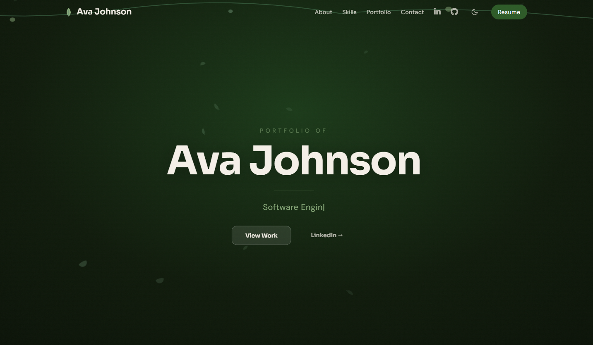

# Portfolio Website

[](https://codecov.io/gh/avaj0hnson/portfolio-website)

A modern, botanical-themed portfolio built with **Angular 18**, **TailwindCSS**, and **TypeScript**. Features interactive SVG animations, mouse-reactive effects, dark mode, and a distinctive design identity — all with standalone components, SSR, and comprehensive test coverage.

**Live:** [avajohnson.dev](https://avajohnson.dev)



---

## Highlights

- **Botanical Design System** — Custom color palette (deep greens, sage, cream, gold), Sora + DM Sans typography, organic section dividers, noise grain texture
- **Interactive Hero** — Mouse parallax across multiple depth layers, SVG flowers that bloom from cursor on hover, animated vine borders
- **Vine Progress Bars** — Skill proficiency visualized as growing vines with leaves sprouting at intervals, color-coded by level
- **3D Tilt Cards** — Project cards respond to mouse position with perspective transforms and dynamic glare
- **Contact Bloom** — Seed SVG that blooms into a 7-petal flower on click, revealing the contact form
- **Dark Mode** — Deep forest theme with `prefers-color-scheme` detection, localStorage persistence, and WCAG AA verified contrast
- **Performance** — Images optimized to WebP with responsive srcset (9.1MB reduced to ~300KB), lazy loading, SSR with prerendering
- **Accessibility** — Skip-to-content, ARIA labels, focus trapping, keyboard navigation, `prefers-reduced-motion` support
- **SEO** — Open Graph, Twitter Card, JSON-LD structured data, meta descriptions

---

## Tech Stack

| Category | Technologies |
|----------|-------------|
| Framework | Angular 18 (standalone components) |
| Styling | TailwindCSS 3, SCSS, Angular Material |
| Animations | CSS-only (no JS animation libraries) |
| Typography | Sora, DM Sans |
| SSR | Angular SSR + Express |
| Testing | Jasmine, Karma, Codecov |
| Contact | Formspree |
| Build | Angular CLI, PostCSS, Sharp (image optimization) |

---

## Project Structure

```
src/app/
├── features/
│   ├── about/                → About section with headshot and bio
│   ├── contact/              → Contact form with bloom animation
│   ├── home/                 → Hero with parallax and ambient blooms
│   ├── portfolio/            → Project showcase with filtering
│   │   ├── models/           → Project types
│   │   ├── project-card/     → Tilt-enabled project cards
│   │   └── project-modal/    → Accessible project detail modal
│   └── skills/               → Skills grid with vine progress bars
├── layout/
│   ├── footer/               → Three-column botanical footer
│   └── navbar/               → Scroll-aware navbar with theme toggle
└── shared/
    ├── components/
    │   ├── ambient-blooms/   → Mouse-reactive flower spawner
    │   ├── bloom/            → SVG flower bloom component
    │   ├── leaf-particles/   → Floating leaf particle system
    │   ├── plant-level/      → Plant growth visualization
    │   ├── section-divider/  → Organic SVG wave dividers
    │   ├── vine/             → Animated vine with leaves
    │   └── vine-bar/         → Vine-based progress bar
    ├── directives/
    │   ├── scroll-reveal/    → Intersection Observer scroll reveal
    │   └── tilt/             → 3D mouse-tracking tilt effect
    └── services/
        └── theme/            → Dark/light mode with persistence
```

---

## Development

```bash
npm install
ng serve              # Dev server at localhost:4200
ng build              # Production build
ng test --code-coverage   # Run 154 tests with coverage
npm run optimize-images   # Regenerate WebP variants
```

---

## Testing

154 unit tests covering all components, directives, and services.

```
Statements : 93%
Branches   : 80%
Functions  : 91%
Lines      : 96%
```

View coverage on [Codecov](https://app.codecov.io/gh/avaj0hnson/portfolio-website).
